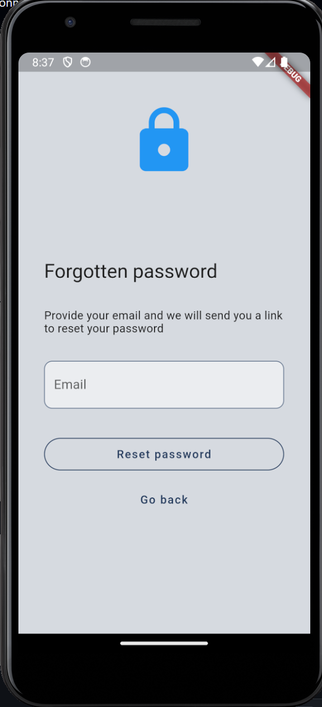
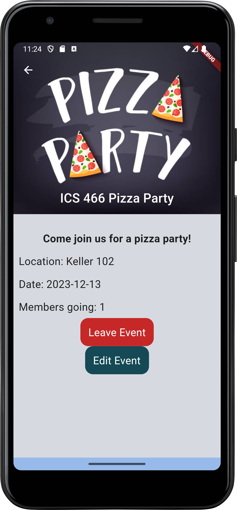

## Motivation
Our motivation for creating this app is to develop a space where a variety of students, which includes foreign, transfer, and incoming freshman students, can connect with others, tackling the issue of an overwhelming lifestyle transition into university. Our app seeks to make connections less intimidating by providing organization as well as a separation between personal socialization and school persona. It serves to encourage students to connect with others so they don't have to put so much effort into searching for similar resources. As frightful as it is to step out of one’s comfort zone and introduce yourself to others, our app will prove to be a comfortable environment that will encourage socialization using an anonymity feature. Centered around group chats, a casual tone will create a sense of friendliness and keep our users comfortable.

## Goals
In order to connect different university students with each other, our app provides access to different University-related groups, activities, and individuals so that students have the ability to make this college lifestyle transition with ease. 

Ideally, our app will have an active user base with people in the University community being actively involved in the creation, management, and interaction of their individual groups and activities. The amount of users active on the app will hopefully reflect the increase of comfort and the decrease in intimidation of connecting within the student demographic.

We also would like to implement a feature that allows the students within a certain group or community to bond with other members of a shared grouping. On top of this, we would like to maintain user retention on the app by motivating them to keep logging on almost daily. Nothing builds comradery faster than having a shared goal. Each group chat will be able to take care and raise a plant into a tree by watering it every day. 

In future implementations of our application, we aim to obtain certain members of different groups that serve as potential “ambassadors” or “leaders” of their groups in order to help manage and encourage members of their communities to help. Having a leadership role also can help to moderate happenings within the group.

## Usage
Below, you can find the different pages that make up our current application implementation of ConnectUni.
Here is the working logo:

- <b>Splash Screen: </b> Upon clicking on the app, the user is presented with a splash screen of our logo, which hopes to combine the idea of connecting university students. Connect (USB Cable) and Uni (The graduation cap). 

- <b>Sign In Page: </b> When the user opens the app, the login page will be the first page seen. On this page, users are given the option to enter in their emails and passwords if they already have an account. If they enter an incorrect email, password, or both an error will occur. The user is also given the option to click the register button to go to the Register page, or hit the "Forgotten password?" text to send an email to their account to reset their password.

- <b>Register Page: </b> If the user has not yet created an account, they will be able to go to the register page and create an account by providing an email and a password. There is a second section for a user to confirm their password to ensure that they are typing it correctly the first time. Upon hitting register, the user will be prompted to validate their email and then will be sent to the "Create profile page".

 

- <b>Create Profile Page: </b> After Signing up, the user is prompted to set up their profile with a Display Name, a profile picture field, a major field, their projected graduation, and an optional status that describes how they are feeling. Currently the profile picture field is only linked to images that are found in our assets folder, but we are aiming to change this in the future.

- <b>Home Page: </b> Upon logging in, the user is shown the Home page displaying a list of groups that the user is currently a part of. There is an add button at the bottom prompting users to add to their current list of groups by creating a group. If the user's group list is empty, the user is prompted to join or add to a group to start filling out the page. The page also is the first introduction to the application AppBar as well as the Navbar at the bottom, which shows the user the groups, messages, event calendar, and their own profile.

- <b>Group Chat Page: </b> A user can select a chat from their joined groups which they can then send and recieve messages from other members of that group.

- <b>Group Info Page: </b> After a user selects a group from the login page, they will be able to see that specific groups information. This will include the members of that group as well as a brief description of what the user can expect from that grouping. There will also be a field that shows the group's interests that the user can search upon. At the bottom there will be either a group join or a group leave button depending on whether or not the user is in the group. If the user is a member of a group, they are also given access to an edit button, which is described below.

- <b>Edit Group Page: </b> If a user is a member of a group, they have the option to edit group information using a form. The form is pre-filled with the change-able aspects of the group. When submitted, the group information is updated in the database. There is also a reset buttton that resets all form fields to empty.

- <b>Add Group Page: </b> There is also an add group page in which a user is able to create a group in the event that there isn't one made for their intended use already. The fields for this are empty with some placeholder information to guide the user to filling out the correct information. This can be accessed from the search groups page (see below) and also allows the user to refresh the page.

  
- <b>Search Groups Page: </b> A user can search for groups to join and can filter certain Clubs/Interests/Majors/etc. in which groups are categorized in. At the bottom of this page is a section in which the user is able to create a group (see the above section).

  

- <b>Search People Page: </b> A user can search for other individuals to connect with and can filter by Clubs/Interests/Majors/etc. in which individuals are apart of.

 

Here is an example of our filter in use:

 

Clicking on these user profiles will bring you to a profile that allows you to view their information, send them a message, friend them, or view/join their groups.

 

- <b>Search Events Page: </b> A user can search for events to attend and can filter by Clubs/Interests/Majors/etc. 

- <b>Create Event Page: </b> Through the search events page, you can navigate to add an event. Since events are linked to groups, the group section of this document is specifically linked to the user's list of groups.

- <b>Event Info Page:</b> The user is able to view the event information and are given a prompt to join. If they are not in the group associated with the event, they are instead prompted to join the group.

 

- <b>Edit Event Page:</b> When the user is in the group associated with the event, they are able to edit it.

- <b>Events Calendar Page: </b> This page displays a calendar to the user which shows the different events that our app is able to host. The user can click on different days in order to get to different events. If there are no events for the selected date, the user is prompted to create an event for that day.

- <b>User Profile Page: </b> If the user clicks on the profile page on the navbar, they will be presented with this page showing their information as it appears to others, their interests, and the groups they are currently a part of. They are able to edit their profile information and interests from this page. If they hit the settings button in the appbar, they will then go to the settings page listed below.

  

- <b>Settings: </b> This is the page that the user will see if they want to change their personal preferences related to the application. As of now, the settings page has a working dark mode switch and a working logout button.

- <b>Dark Mode: </b> Our application implements a work-in-progress dark mode in which the user is able to change the preferences of their application theme within the settings page. The application will then invert colors to a different theme.

- <b>Friends List Page: </b> This page lists the user's current friends. They can also tap to direct message them from this page.

- <b>Notifications and Friend Requests: </b> Users are now able to send and view friend requests in their profiles. They can view and accept these in the notifications page.
  

- <b>Group Chats: </b> Every group now has a chat associated with it that allows the user to send messages to their peers. They are also able to see the person who sent the message and click on their profile if need be.

## Privacy Policy

To view our Privacy Policy, please visit [this site](https://connectuni.github.io/privacy.github.io/).

## Installation
Go to [this github repository](https://github.com/ConnectUni/connectuni), click on the green Code button, and click Open with GitHub Desktop.

Next, open IntelliJ then open a new project and select connectuni from your files.
Finally, open the terminal and type:
`flutter run`

## Development Status
Our application development is split up into the following sections:

* [Future Plans](https://github.com/orgs/ConnectUni/projects/1/views/8)
* [Phase 5](https://github.com/orgs/ConnectUni/projects/1/views/11)
* [Phase 4](https://github.com/orgs/ConnectUni/projects/1/views/10)
* [Phase 3](https://github.com/orgs/ConnectUni/projects/1/views/9)
* [Phase 2](https://github.com/orgs/ConnectUni/projects/1/views/7)
* [Phase 1](https://github.com/orgs/ConnectUni/projects/1/views/1)

## Evaluation Process / Usability Testing:
[Click here to view our Evaluation Design!](https://connectuni.github.io/evaluation.html)

## Deployment:
Our application is deployed on the Google Play Store and can be found here: 

[Click here to view our Application on the Google Play Store!](https://play.google.com/store/apps/details?id=com.connectuni.connectuni&hl=en-US&ah=FEh_CeHQPXa7GgoDDt96qZL4AXc&pli=1)

## Post-ICS466 plans:
Following our application's lifecycle throughout our ICS 466 Course, we plan on improving our application based on the Usability Design evaluation feedback.
Our main focus will be on: 
1. Events not working fully in the current implementation.
2. Any image uploading to the application doesn't work.
3. Any group members are able to edit the group information (need ownership property).

There are some other small UI/database changes that we would like to make to at least make sure our application is able to deliver all of the features that the user can see throughout our application.
Depending on how timely we are able to fix these UI changes, we will be attempting to conduct more usability evaluations given the time we have between the fix and the final submission.
There are also some features that we would like to implement past the ICS 466 course that deal with user-retention in our application and giving them a drive to use our application more often.

## About Us

### Kenji Sanehira

Hey! I am Kenji Sanehira and I am currently a Computer Science senior at the University of Hawaii at Manoa. I would like to apply my knowledge from school related to Computer Science into the workforce. I am also the stage manager for the international-tour of the musical "Peace on Your Wings". In my free time, I enjoy 3D printing, going to the gym, and playing video games. Learning about mobile application development for ConnectUni has been a really fun and educational experience that I hope to apply skills from in the future. For this application I was able to design the profile and group info pages, create the ConnectUni logo, implemented the Events Calendar, create form pages for creating and editing objects, as well as implemented our own version of a direct messaging / group chat program.

[Click here to view Kenji's LinkedIn Profile](https://www.linkedin.com/in/kenji-sanehira/)

### Michelle Ho

Hi everyone! My name is Michelle and I'm currently a senior Computer Science student pursuing my B.S. degree. I'd describe myself as a competitive person who loves to stay active. Whether it be sports or puzzles, I find myself competing with family and friends all of the time. With that said, I welcome all sorts of challenges one may have! I'm glad to be a part of a friendly team working together on the ConnectUni project. 

#### Contributions
In this project, I was able to learn about the Flutter framework through:
- Creating the initial Login/Signup pages with manual authentication from Riverpod
- Standardizing mock databases (UserDB, MessagesDB, etc.)
- Ensuring routing works properly - enable a "back arrow" only when desired
- Fixing general bugs (EX: broken group chat page when a user leaves a group)

I was also able to learn about the deployment process as I was in charge of deploying our application to the Google Play store.

[Michelle's LinkedIn Profile](https://www.linkedin.com/in/michelle-ho-4949a0262/)

### Raphael Bumanlag

Aloha! I am Raphael, and I am a senior studying for my B.S. in Computer Science. I am an aspiring software engineer and desire to work as a backend developer. I enjoy surfing, rollerblading, and weightlifting on my free time. I consider myself to be a very social student which is what drives me to develop a mobile app that enables other students, especially students who are less social or students in a new environment, to connect with other students in similar classes or interests!

### Jiahui Liao

Hi! I am Jia, a senior studying Computer Science at University of Hawaii at Manoa. I am also the coding officer for the Game Development club as well as marketing manager for the Association for Computing Machinery (ACM) at UHM. I like to draw, crochet, and play video games in my free time. I hope to learn skills that I can apply in the future and have fun doing it. By working on ConnectUni, I hope to support students to build a fun and lasting community for themselves.

#### Contributions
- Creating initial pages including create event, create profile, direct message page and chat screen.
- Standardizing mock databases (ChatDB) and implementing the events provider.
- In the final stages of the app, I implemented events (edit events page, event forms, and updating event info once a user joins)
- Implemented FlexColorScheme to allow for dark mode and light mode.
- Fixing general bugs (EX: routing between pages, UI)
