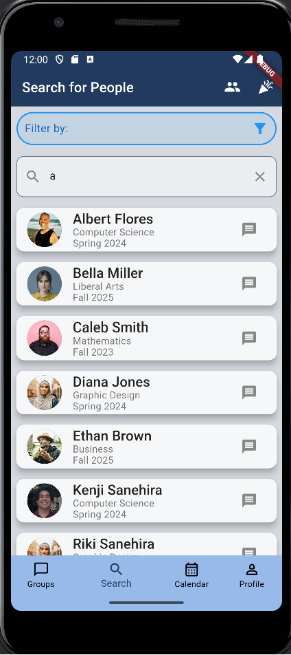

## Motivation
Our motivation for creating this app is to develop a space where a variety of students, which includes foreign, transfer, and incoming freshman students, can connect with others, tackling the issue of an overwhelming lifestyle transition into university. Our app seeks to make connections less intimidating by providing organization as well as a separation between personal socialization and school persona. It serves to encourage students to connect with others so they don't have to put so much effort into searching for similar resources. As frightful as it is to step out of one’s comfort zone and introduce yourself to others, our app will prove to be a comfortable environment that will encourage socialization using an anonymity feature. Centered around group chats, a casual tone will create a sense of friendliness and keep our users comfortable.

## Goals
In order to connect different university students with each other, our app provides access to different University-related groups, activities, and individuals so that students have the ability to make this college lifestyle transition with ease. 

Ideally, our app will have an active user base with people in the University community being actively involved in the creation, management, and interaction of their individual groups and activities. The amount of users active on the app will hopefully reflect the increase of comfort and the decrease in intimidation of connecting within the student demographic.

We also would like to implement a feature that allows the students within a certain group or community to bond with other members of a shared grouping. On top of this, we would like to maintain user retention on the app by motivating them to keep logging on almost daily. Nothing builds comradery faster than having a shared goal. Group chat trees -> encourage daily interaction.

In future implementations of our application, we aim to obtain certain members of different groups that serve as potential “ambassadors” or “leaders” (PARTY PEOPLE) of their groups in order to help manage and encourage members of their communities to help. Having a leadership role also can help to keep chaotic members out.

profile section/avatar
have access to the different groups (options)

## Usage
- <b>Home Page: </b> Upon logging in, the user is shown the Home page displaying a list of groups that the user is currently a part of. There is an add button at
the bottom prompting users to add to their current list of groups. The page also is the first introduction to the applications AppBar as well as the Navbar at the
bottom, which shows the user the groups, messages, and their own profile.

- <b>Group Info Page: </b> After a user selects a group from the login page, they will be able to see that specific groups information. This will include the members of that group as well as a brief description of what the user can expect from that grouping.

- <b>Search Groups Page: </b> A user can search for groups to join and can filter certain Clubs/Interests/Majors/etc. in which groups are categorized in.

- <b>Search People Page: </b> A user can search for other individuals to connect with and can filter by Clubs/Interests/Majors/etc. in which individuals are apart of.

- <b>Settings: </b> This is the page that the user will see if they want to change their personal preferences related to the application.

## Installation
Go to https://github.com/ConnectUni/connectuni, click on the green Code button, and click Open with GitHub Desktop.

Next, open IntelliJ then open a new project and select connectuni from your files.
Finally, open the terminal and type:
`flutter run`

## Development Status
https://github.com/orgs/ConnectUni/projects/1

## About Us

### Kenji Sanehira

Hey! I am Kenji Sanehira and I am currently a Computer Science senior at the University of Hawaii at Manoa. I would like to apply my knowledge from school related to Computer Science into the workforce. I am also the stage manager for the international-tour of the musical "Peace on Your Wings". In my free time, I enjoy 3D printing, going to the gym, and playing video games. Learning about mobile application development for ConnectUni has been a really fun and educational experience that I hope to apply skills from in the future.

### Michelle Ho

### Raphael Bumanlag

Aloha! I am Raphael, and I am a senior studying for my B.S. in Computer Science. I am an aspiring software engineer and desire to work as a backend developer. I enjoy surfing, rollerblading, and weightlifting on my free time. I consider myself to be a very social student which is what drives me to develop a mobile app that enables other students, especially students who are less social or students in a new environment, to connect with other students in similar classes or interests!

### Jiahui Liao
