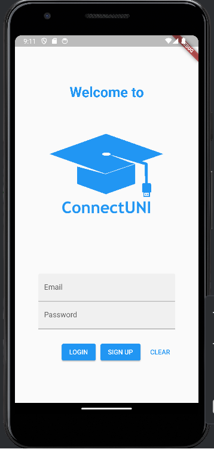
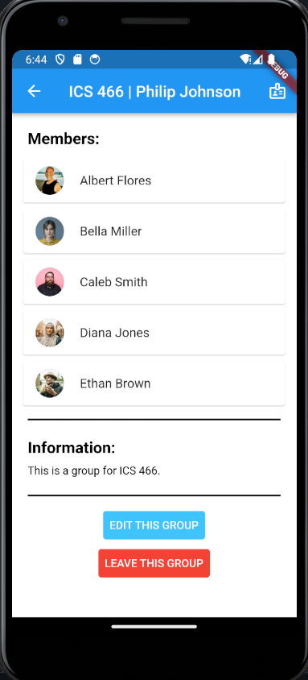
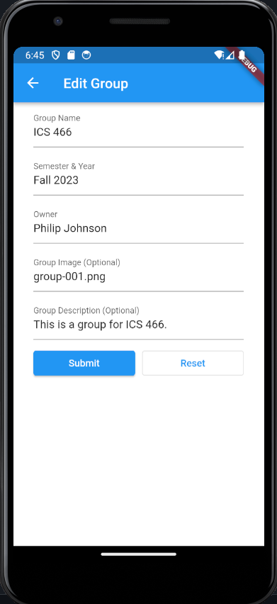
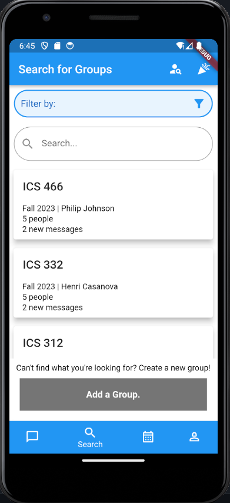

## Motivation
Our motivation for creating this app is to develop a space where a variety of students, which includes foreign, transfer, and incoming freshman students, can connect with others, tackling the issue of an overwhelming lifestyle transition into university. Our app seeks to make connections less intimidating by providing organization as well as a separation between personal socialization and school persona. It serves to encourage students to connect with others so they don't have to put so much effort into searching for similar resources. As frightful as it is to step out of one’s comfort zone and introduce yourself to others, our app will prove to be a comfortable environment that will encourage socialization using an anonymity feature. Centered around group chats, a casual tone will create a sense of friendliness and keep our users comfortable.

## Goals
In order to connect different university students with each other, our app provides access to different University-related groups, activities, and individuals so that students have the ability to make this college lifestyle transition with ease. 

Ideally, our app will have an active user base with people in the University community being actively involved in the creation, management, and interaction of their individual groups and activities. The amount of users active on the app will hopefully reflect the increase of comfort and the decrease in intimidation of connecting within the student demographic.

We also would like to implement a feature that allows the students within a certain group or community to bond with other members of a shared grouping. On top of this, we would like to maintain user retention on the app by motivating them to keep logging on almost daily. Nothing builds comradery faster than having a shared goal. Each group chat will be able to take care and raise a plant into a tree by watering it every day. 

In future implementations of our application, we aim to obtain certain members of different groups that serve as potential “ambassadors” or “leaders” of their groups in order to help manage and encourage members of their communities to help. Having a leadership role also can help to moderate happenings within the group.

## Usage
Below, you can find the different pages that make up our current application implementation of ConnectUni.
Here is the working logo:

- <b>Splash Screen: </b> Upon clicking on the app, the user is presented with a splash screen of our logo, which hopes to combine the idea of connecting university students. Connect (USB Cable) and Uni (The graduation cap).
  

- <b>Login Page: </b> When the user opens the app, the login page will be the first page seen. This is where current users will put in their UH email and password used to open their account. As of now, must enter "correct" as the username and "pass" as the password fields in order to access the Home page with the "Login" button. Has a "Sign Up" button that'll prompt the user to register for an account on a separate screen.

- <b>Sign Up Page: </b> From the Login page (via the "Sign Up" button), the user is able to register for a new account. There are four text fields present, each must be filled out before an account can be made. Only when all fields are filled and the two password text fields match, will it switch to the user's Home screen. Still working on the Create Profile screen, which is the screen we intend to build next. There are three buttons available to the user: Sign Up, Clear, and Back. The Back button will go back to the Login page, the Clear button will clear all text fields, and the Sign Up button should prompt the user to a Create Profile page.

- <b>Home Page: </b> Upon logging in, the user is shown the Home page displaying a list of groups that the user is currently a part of. There is an add button at the bottom prompting users to add to their current list of groups. The page also is the first introduction to the application AppBar as well as the Navbar at the bottom, which shows the user the groups, messages, event calendar, and their own profile.

- <b>Group Chat Page: </b> A user can select a chat from their joined groups which they can then send and recieve messages from other members of that group.

- <b>Group Info Page: </b> After a user selects a group from the login page, they will be able to see that specific groups information. This will include the members of that group as well as a brief description of what the user can expect from that grouping. At the bottom there will be either a group join or a group leave button depending on whether or not the user is in the group. If the user is a member of a group, they are also given access to an edit button, which is described below.

- <b>Edit Group Page: </b> If a user is a member of a group, they have the option to edit group information using a form. The form is pre-filled with the change-able aspects of the group. When submitted, the group information is updated in the database. There is also a reset buttton that resets all form fields to empty.

- <b>Add Group Page: </b> There is also an add group page in which a user is able to create a group in the event that there isn't one made for their intended use already. The fields for this are empty with some placeholder information to guide the user to filling out the correct information. This can be accessed from the search groups page (see below) and also allows the user to refresh the page.

  
- <b>Search Groups Page: </b> A user can search for groups to join and can filter certain Clubs/Interests/Majors/etc. in which groups are categorized in. At the bottom of this page is a section in which the user is able to create a group (see the above section).

- <b>Search People Page: </b> A user can search for other individuals to connect with and can filter by Clubs/Interests/Majors/etc. in which individuals are apart of.

- <b>Search Events Page: </b> A user can search for events to attend and can filter by Clubs/Interests/Majors/etc. 

- <b>Events Calendar Page: </b> This page displays a calendar to the user which shows the different events that our app is able to host. The user can click on different days in order to get to different events. Eventually we will be able to sort using the sort prompt at the top of the page.
  

- <b>User Profile Page: </b> If the user clicks on the profile page on the navbar, they will be presented with this page showing their information as it appears to others, their interests, and the groups they are currently a part of. If they hit the settings button in the appbar, they will then go to the settings page listed below.

- <b>Settings: </b> This is the page that the user will see if they want to change their personal preferences related to the application. As of now, the settings page has a working dark mode switch and a working logout button.

- <b>Dark Mode: </b> Our application implements a work-in-progress dark mode in which the user is able to change the preferences of their application theme within the settings page. The application will then invert colors to a different theme. Right now we have the actual functionality of the dark mode working, but the theme is still not fully implemented.

- <b>Friends List Page: </b> This page lists the user's current friends. They can tap to direct message them from this page.

- <b>Direct Messages Page: </b> After selecting the inbox on the group info page, the user is led to their direct messages which provides a list of people recently contacted.

- <b>Message Details Page: </b>When the user taps on a person from their list of contacts, they are led to their chat history.

## Installation
Go to [this github repository](https://github.com/ConnectUni/connectuni), click on the green Code button, and click Open with GitHub Desktop.

Next, open IntelliJ then open a new project and select connectuni from your files.
Finally, open the terminal and type:
`flutter run`

## Development Status
[Click here to view the ConnectUni Project Board!](https://github.com/orgs/ConnectUni/projects/1/views/7)

## About Us

### Kenji Sanehira

Hey! I am Kenji Sanehira and I am currently a Computer Science senior at the University of Hawaii at Manoa. I would like to apply my knowledge from school related to Computer Science into the workforce. I am also the stage manager for the international-tour of the musical "Peace on Your Wings". In my free time, I enjoy 3D printing, going to the gym, and playing video games. Learning about mobile application development for ConnectUni has been a really fun and educational experience that I hope to apply skills from in the future.

### Michelle Ho

Hi everyone! My name is Michelle and I'm currently a senior Computer Science student pursuing my B.S. degree. I'd describe myself as a competitive person who loves to stay active. Whether it be sports or puzzles, I find myself competing with family and friends all of the time. With that said, I welcome all sorts of challenges one may have! I'm glad to be a part of a friendly team working together on the ConnectUni project. I know that this project will prove to be worth it when we're all standing proud, presenting our new app.

### Raphael Bumanlag

Aloha! I am Raphael, and I am a senior studying for my B.S. in Computer Science. I am an aspiring software engineer and desire to work as a backend developer. I enjoy surfing, rollerblading, and weightlifting on my free time. I consider myself to be a very social student which is what drives me to develop a mobile app that enables other students, especially students who are less social or students in a new environment, to connect with other students in similar classes or interests!

### Jiahui Liao

Hi! I am Jia, a senior studying Computer Science at University of Hawaii at Manoa. I am also the coding officer for the Game Development club as well as marketing manager for the Association for Computing Machinery (ACM) at UHM. I like to draw, crochet, and play video games in my free time. I hope to learn skills that I can apply in the future and have fun doing it. By working on ConnectUni, I hope to support students to build a fun and lasting community for themselves.
